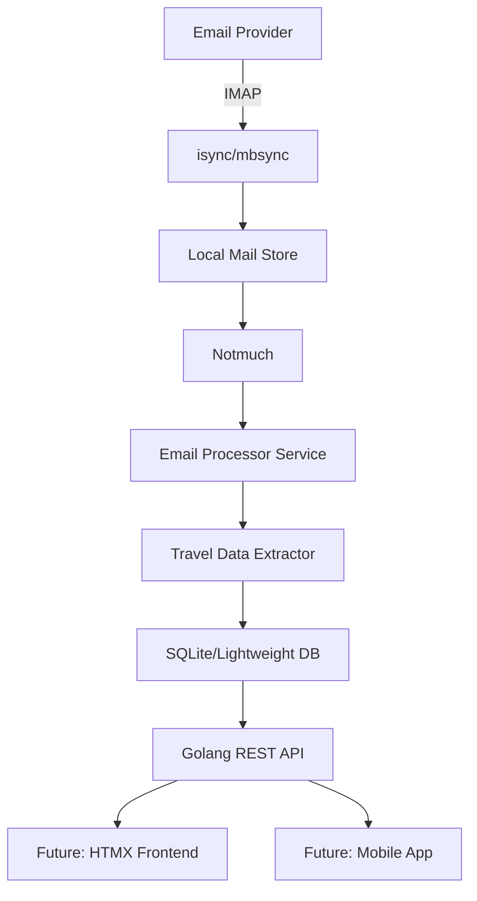
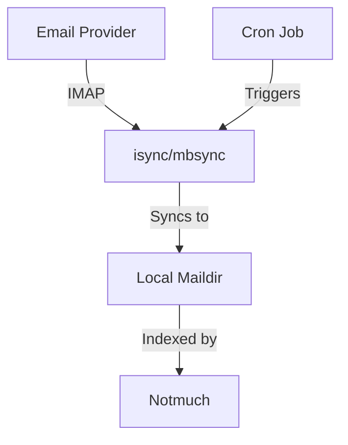
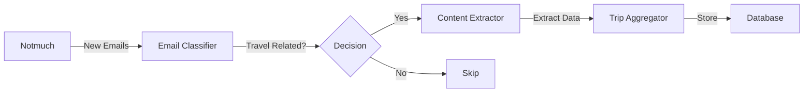
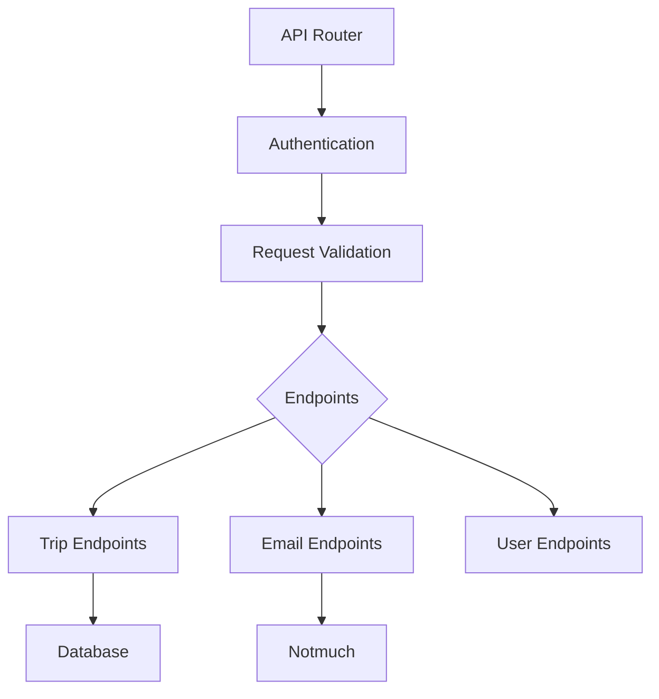

# Voyage Architecture

This document outlines the architecture of the Voyage travel plan aggregator system.

## System Overview

Voyage is designed as a modular, containerized application that processes email data to extract and organize travel information. The system is built with scalability and extensibility in mind, allowing for future enhancements and additional features.



## Core Components

### 1. Email Fetching Service



The Email Fetching Service is responsible for retrieving emails from the user's email accounts. It uses isync/mbsync, a lightweight and reliable IMAP synchronization tool, to download emails to a local Maildir store. This component:

- Securely manages email account credentials
- Performs regular synchronization at configurable intervals
- Supports multiple email accounts
- Handles connection errors and implements retry logic
- Integrates with Notmuch for email indexing and tagging

### 2. Email Processing Pipeline



The Email Processing Pipeline analyzes emails to identify travel-related content and extract structured data. This component:

- Uses Notmuch queries to identify new or unprocessed emails
- Classifies emails as travel-related or not
- Extracts key information from travel emails (dates, locations, confirmation numbers, etc.)
- Parses different email formats from various travel providers
- Groups related travel items into coherent trips
- Stores processed information in a structured format

### 3. REST API



The REST API provides programmatic access to the travel data. Built with Go, it follows RESTful design principles and includes:

- JSON-based communication
- Versioned endpoints
- Authentication and authorization
- Comprehensive error handling
- Pagination for list endpoints
- Filtering and sorting options
- Documentation via OpenAPI/Swagger

## Project Structure

```
tbd              
```
